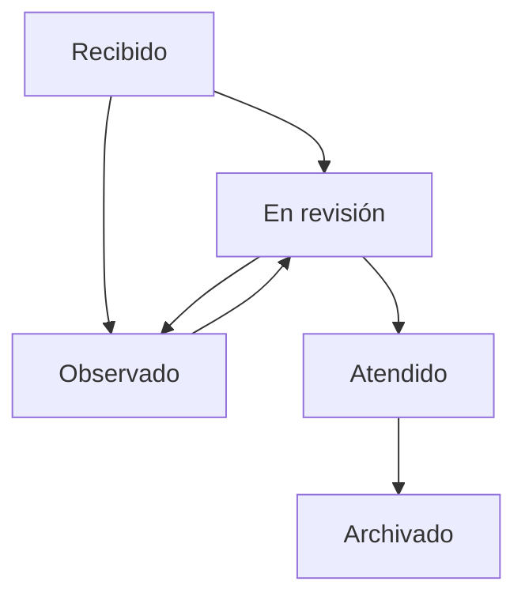

# Alcance inicial y decisiones

## Qué hace una municipalidad

Una municipalidad atiende solicitudes de vecinos y empresas, organiza servicios locales y gestiona áreas como desarrollo urbano, licencias, limpieza, seguridad ciudadana, atención social y administración. La distribución concreta de funciones cambia según la entidad y su tipo. Por eso MuniGest empieza con un proceso transversal: recibir, derivar y seguir expedientes.

La entidad indicada es la **Municipalidad Provincial de Chiclayo**. Se verificaron sus fuentes institucionales y sistemas existentes; ver [CHICLAYO.md](CHICLAYO.md). El organigrama publicado orienta los destinos iniciales y el TUPA enlazado sirve como referencia para validar las fichas con las áreas responsables.

## Flujo elegido

| Etapa | Responsable | Resultado |
|---|---|---|
| Recepción | Mesa de Partes | Solicitante, documentos y código interno del expediente |
| Derivación | Mesa de Partes o gestor | Expediente asignado al área competente |
| Revisión | Gestor del área | Actuación documentada o solicitud de subsanación |
| Observación | Gestor del área | Motivo registrado; retorna a revisión al subsanarse |
| Atención | Gestor del área | Respuesta registrada internamente |
| Archivo | Personal autorizado | Consulta posterior; se bloquean nuevas modificaciones desde la app |

**Atendido** registra una actuación interna. No prueba una notificación legal al ciudadano ni sustituye una resolución firmada. La fecha objetivo es operativa: no calcula días hábiles, feriados, suspensión de plazos ni silencio administrativo.

## Entrega 0.1

Aplicación interna para una municipalidad y una base de datos. No es un sistema multientidad. Un perfil de Mesa de Partes puede recibir y consultar todos los expedientes; los gestores y perfiles de consulta acceden a su área actual. Al derivar a otra área, el gestor anterior deja de tener acceso. Si la entidad necesita acceso histórico de las áreas participantes, se debe acordar y ampliar expresamente el modelo.

Se cargaron catorce gerencias verificadas y un punto de recepción para el piloto, además de una solicitud general de referencia. No se han cargado personas ni expedientes reales, ni procedimientos TUPA inventados. No hay comprobación automática de identidad ante RENIEC o SUNAT. Los códigos internos no se sincronizan con el SGD de Chiclayo.

## Siguientes módulos elegidos

| Prioridad | Módulo | Dependencia necesaria |
|---|---|---|
| 1 | Validación del piloto, catálogo TUPA y usuarios | Identidad y gerencias iniciales cargadas; faltan responsables y revisión de fichas |
| 2 | Integración con mesa de partes y SGD existentes | Contrato de API o exportación, mapeo de identificadores y flujo acordado con la MPCH |
| 3 | Licencias y autorizaciones | TUPA vigente y flujos validados por las áreas |
| 4 | Incidencias de servicios públicos | Responsables, territorios y reglas de atención |
| 5 | Integraciones con recaudación y otros sistemas | Sistemas existentes y APIs autorizadas por la municipalidad |

Esta entrega no calcula impuestos, emite comprobantes oficiales, realiza pagos ni reemplaza los sistemas contables de la entidad. Esos módulos requieren reglas y responsables propios.

## Arquitectura

La UI y la lógica del cliente están escritas en Python. Flet renderiza controles nativos con Flutter. Supabase aporta PostgreSQL, autenticación, API y almacenamiento. Las reglas críticas se aplican también en SQL, de modo que no dependan de que el usuario utilice esta interfaz.

El servidor web mantiene una instancia de repositorio y sesión por usuario. Los clientes nativos llaman a la misma API con la clave publicable y el JWT del trabajador. No se guarda la contraseña, el token ni documentos reales en un caché de disco. La primera versión requiere conexión para trabajar con datos reales.

## Estados del expediente

La derivación cambia el área de destino y registra su motivo. Los expedientes atendidos y archivados bloquean nuevas cargas de documentos desde el cliente.
