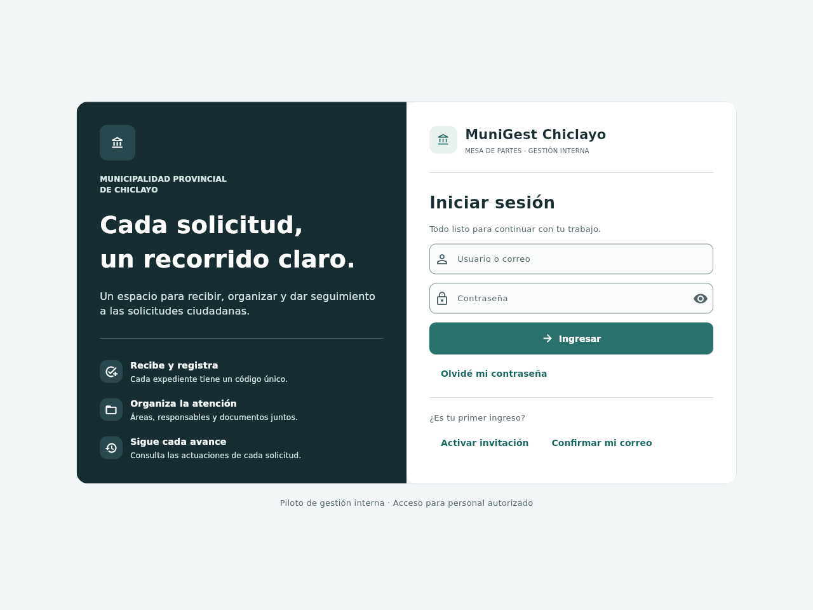
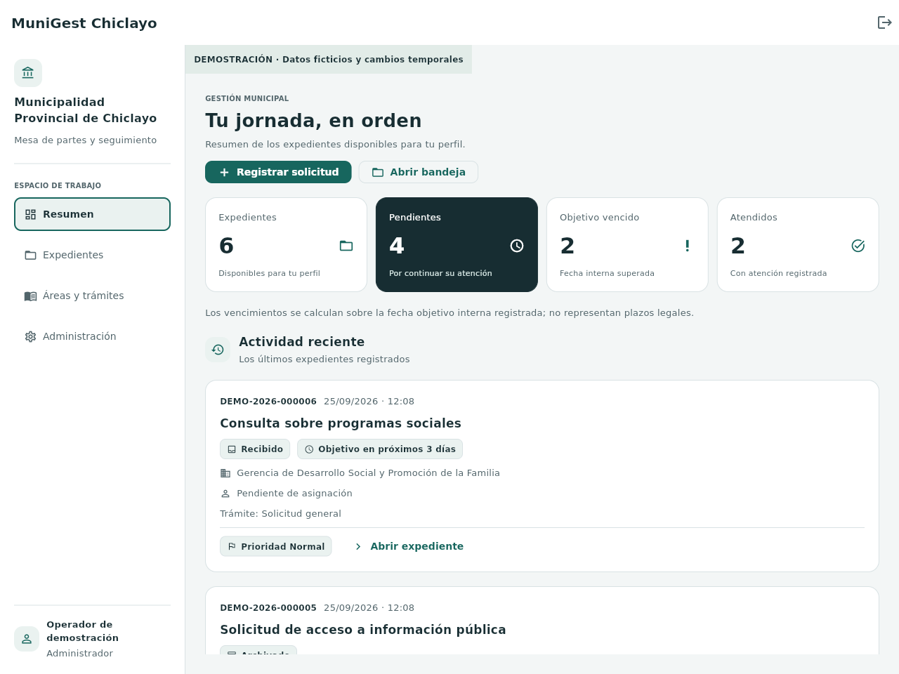

# Diseño de MuniGest Chiclayo

Actualización del 25 de septiembre de 2026. La interfaz conserva los procesos de
mesa de partes y mejora su presentación en escritorio y móvil.

## Capturas de la aplicación

Acceso en escritorio:



Resumen en escritorio, con expedientes ficticios de demostración:



[Resumen en ventana móvil de 390 píxeles](images/resumen-movil.png) ·
[Formulario de registro](images/registro-escritorio.png)

Las veinte capturas de la revisión, las 117 pruebas Python, Ruff y los contratos
de PostgreSQL aprobaron en la [ejecución 25](https://github.com/VillenetMK/sistema-municipal/actions/runs/36165124312),
sobre el código `2b046b73297ad5cbf1d0532d5b3ae14c588d4455`.

El mismo diseño está en el [APK Android piloto 8](https://github.com/VillenetMK/sistema-municipal/releases/tag/android-piloto-8),
con ambas variantes aprobadas en el emulador Android 15.

## Cambios visibles

- Acceso con identidad, descripción del servicio y formulario en dos columnas
  en escritorio; una columna con el formulario en el teléfono.
- Navegación lateral con borde, fondo y texto destacado en la sección activa.
- Resumen con indicadores, iconos y explicaciones breves.
- Expedientes con código, estado, área, responsable y prioridad identificables.
- Formularios con campos de ancho completo y secciones de solicitante, solicitud,
  documentos, organización e historial.
- Búsqueda y estado visibles en la bandeja; el resto de filtros se despliega en
  **Filtros avanzados**. Al aplicar un criterio avanzado, el panel permanece
  abierto y muestra cuántos criterios están activos. Cerrarlo conserva los valores.
- Recuperación, invitaciones, administración y reportes comparten el mismo estilo.

Los colores, fuentes y componentes comunes están en `src/munigest/design.py`.
Los estados siempre tienen texto; sus iconos añaden otra señal. La selección del
menú tiene borde y peso tipográfico, además de fondo. Los contrastes calculados
de los textos principales sobre blanco son 14.40:1, 6.12:1 y 6.78:1. Esto describe
esa paleta; no equivale a certificar la accesibilidad de toda la aplicación.

## Revisión reproducible

`scripts/visual_smoke.py` abre el cliente nativo de Flet y captura diez pantallas
en ventanas de 1280 y 390 píxeles: acceso, recuperación, resumen, bandeja, filtros,
registro, expediente, catálogo, administración y reporte. Usa exclusivamente
`DemoRepository`; no envía credenciales ni consulta la base municipal.

El trabajo **Interfaz nativa en escritorio y móvil**, dentro de **Pruebas y
permisos**, conserva imágenes PNG, dimensiones y registro de ejecución en el
artefacto `revision-diseno`. No son maquetas. Una ventana estrecha de escritorio
comprueba la distribución; las pruebas del APK complementan esa revisión en
Android 15 y su selector de archivos.

La regresión Python comprueba que la sección activa cambie con la navegación y
que cerrar los filtros avanzados no descarte los valores al aplicarlos.

Para actualizar la copia de Windows, cerrar la aplicación y ejecutar en la
carpeta del repositorio:

```powershell
git pull --ff-only origin main
py -3.12 -m uv sync --frozen --extra desktop
py -3.12 -m uv run python run.py
```
