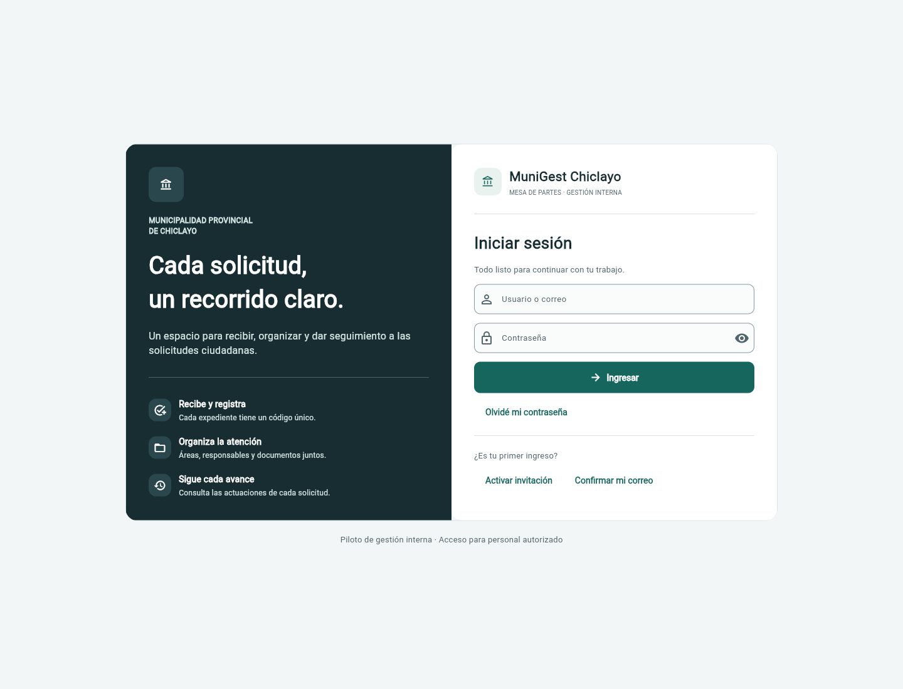

# MuniGest en el navegador

Dirección del piloto: **https://villenetmk.github.io/sistema-municipal/**

Se utiliza la misma aplicación Python que en escritorio y Android. Flet y Pyodide
ejecutan el cliente dentro del navegador; GitHub Pages sirve sus archivos y Supabase
gestiona las cuentas, los expedientes y los documentos. No hace falta instalar Python
ni mantener una computadora encendida.



## Entrar

1. Abrir el enlace con conexión a Internet. La primera carga descarga el entorno de
   ejecución y puede tardar varios segundos.
2. Escribir el usuario o correo y la contraseña de una cuenta municipal activa.
3. Actualizar con F5 conserva el acceso en esa pestaña y vuelve a consultar la información.
4. Pulsar **Cerrar sesión** al terminar: una recarga posterior vuelve al formulario de acceso.
   Los registros confirmados permanecen en Supabase.

La cuenta administradora del piloto admite el alias `admin`. Las contraseñas se
entregan por separado y no se incluyen en el repositorio ni en los archivos publicados.

## Publicación desde GitHub

En **Settings → Pages → Source** se utiliza **GitHub Actions**. El flujo
[Publicar MuniGest web](../.github/workflows/web.yml) se ejecuta al modificar el código
en `main` y también admite ejecución manual desde Actions.

Antes de publicar, el flujo ejecuta las pruebas Python y abre dos compilaciones en
Chromium: una municipal y otra de demostración. Solo se publica la municipal. La
demostración comprueba los documentos con expedientes ficticios en memoria, sin
escribir en la base municipal. Si alguna comprobación falla, la publicación se detiene
y la versión anterior permanece disponible.

El empaquetado permite únicamente los módulos de la aplicación, sus requisitos y
la configuración pública del proyecto `lxvmwjcqdjoidgpinmgm`. Excluye `.env`, scripts
administrativos, pruebas, copias de seguridad y credenciales secretas.

## Conexión y archivos

- `BrowserTransport` adapta HTTPX a Fetch únicamente en Pyodide, conservando los
  permisos de la sesión, los errores HTTP y un tiempo límite con cancelación.
- Las peticiones no usan cookies del navegador ni siguen redirecciones con las
  credenciales. La versión web conserva únicamente los tokens y su vencimiento mediante
  `SecureStorage`, cifrados en `sessionStorage` y separados por proyecto. No guarda
  contraseñas, perfiles, permisos ni documentos. El almacenamiento de la pestaña permite
  recuperar la sesión tras F5; no es una opción de recordar el acceso entre navegadores.
- Al recargar se valida la identidad con Auth y se consulta el perfil municipal activo.
  Los tokens vencidos se renuevan y sus reemplazos se guardan. Un rechazo de Auth o un
  perfil inactivo elimina la sesión; un fallo temporal de conexión permite volver a
  intentarlo. **Cerrar sesión** borra el acceso guardado incluso si falla la red.
- Los PDF y CSV se generan en memoria. En navegador no se intenta crear hilos de
  Python; escritorio y Android conservan la ejecución en segundo plano.
- Los adjuntos se seleccionan y descargan con los controles del navegador.
- Las políticas de Supabase siguen controlando cada lectura y escritura. Publicar
  la interfaz no convierte los expedientes ni el almacenamiento documental en públicos.

Esta entrega conserva el alcance de piloto interno; no representa una publicación
oficial de la Municipalidad Provincial de Chiclayo.

## Compilar para una comprobación local

```bash
uv sync --frozen
uv run python scripts/build_web.py --mode supabase
uv run python -m http.server 8000 --directory dist
```

Abrir `http://localhost:8000/sistema-municipal/`. El servidor local entrega solo
archivos; la ejecución de Python ocurre en el navegador. Para la alternativa con
Python ejecutándose en un servidor, consultar [despliegue con Docker](DESPLIEGUE.md).
